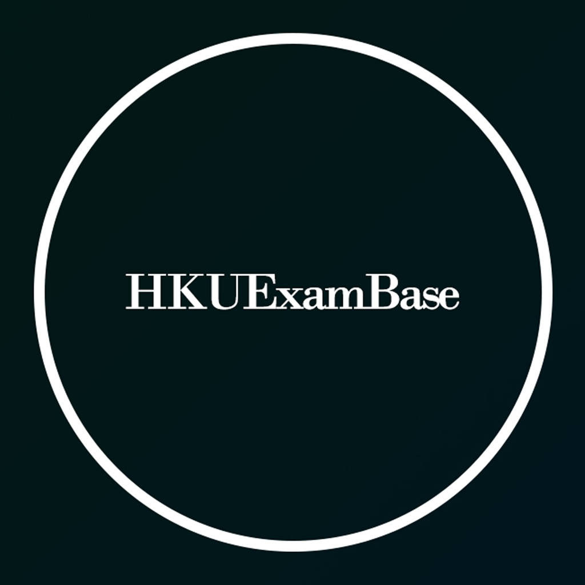

# 📖HKUExamBase 

> HKUExamBase is a refined HKUL ExamBase Web App, aiming to provide an easy way to search Pastpaper for HKU students.

    

# 【✨2019年HKU 終於有自己嘅HKUExamBase嗱!! ✨】

## 功能

HKUExamBase 係一個重新編製HKUL ExamBase介面同功能嘅網頁應用程式，為港大學生提供一個簡單快捷揾Pastpaper嘅平台。

✔ 精簡介面，顯示Pastpaper 課題、日期、學系等資訊

✔ 簡單找出所有相關嘅Pastpaper (例：當搜尋COMP2119時, COMP2119, CSIS1119, CSIS1119A/B/C/D/X 的Pastpaper 亦會相應列出)

未來將會加入更多功能及更多pastpaper來源，敬請期待。

# 【✨In 2019, HKU finally has our own HKUExamBase!! ✨】

HKUExamBase is a refined HKUL ExamBase Web App, aiming to provide an easy way to search Pastpaper for HKU students.

## Features

✔ Streamlined user interface, clearly displaying the course title, date, department and other information

✔ Find out all related pastpaper in one click (e.g. when you search COMP2119, the pastpaper of COMP2119, CSIS1119, CSIS1119A/B/C/D will also be listed)

More functions and sources of pastpaper will be added later in the future. Please be ready for the updates!

## Source

* [HKUL Exambase](http://exambase.lib.hku.hk.eproxy.lib.hku.hk/exhibits/show/exam/home)